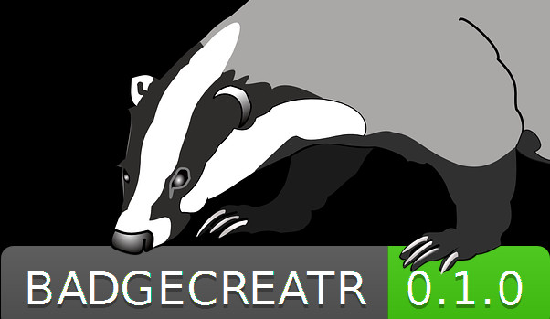

   

------------------------------------------------------------------------

<<<<<<< HEAD
  

------------------------------------------------------------------------

=======
  

------------------------------------------------------------------------

>>>>>>> 6c78ca9... [skip ci]  updated readme to reflect version on CRAN

<!-- README.md is generated from README.Rmd. Please edit that file -->

Introduction
============

This package was inspired by the [badgerbadger](https://github.com/badges/badgerbadgerbadger) package that checks for badges of travis, code coverage open issues, dependencies and licenses. It would be nice to have a simple function that adds these things to a readme.rmd file in R. It will save you typing and searching for the exact markdown on the websites of travis, codecov, repostatus.org etc.

This package does now place the following badges /shields:

-   \[x\] repo status according to <http://www.repostatus.org/>
-   \[x\] licence (recognize from DESCRIPTION file)
-   \[x\] travis shield
-   \[x\] code coverage
-   \[x\] minimal R version (recognize from DESCRIPTION file)
-   \[x\] cran badge
-   \[x\] packageversion (recognize from DESCRIPTION file)
-   \[x\] last change (this will automagically update everytime you knit your readme.rmd)

Possible future badges

-   \[\] nr of open issues
-   \[\] number of pull requests
-   \[\] number of downloads CRAN
-   \[\] number of dependencies and:
-   \[\] a way to visualize their version

Workflow
========

I like to use the following workflow:

-   start a new project in rstudio
-   after some functions are made start a package
-   start a github repo
-   create a readme.rmd
-   ( *this is where badgecreatr comes in*) create badges
-   continue with the project
-   submit to cran, bioconductor, ropensci etc

You will probably call badgecreatr only once, somewhere during your work.

If you call badgecreatr again when you already have badges, they will be recognized. \[(see CHANGELOG)\]\](CHANGELOG.md)

Installation
============

badgecreatr is on [CRAN](https://cran.r-project.org/package=badgecreatr), install using `install.packages("badgecreatr")`

The newest 'developmental' version is installed with `devtools::install_github("rmhogervorst/badgecreatr")`

use
===

Whenever you have created a readme, use badgeplacer() or don't even load the package I would just call `badgecreatr::badgeplacer(githubaccount = "RMHogervorst",githubrepo = "badgecreatr")` for this package.

And if I would just start with this package I would make a different status:

`badgecreatr::badgeplacer(status = "wip"  ,  githubaccount = "RMHogervorst",githubrepo = "badgecreatr")` Which would make this a work in progress status badge.

Use
===

You will have to supply the github accountname, repo and branch. I'm working to automatically recognize those.

Contact
=======

Want to help or have questions?
Contact me directly, use an [issue](https://github.com/RMHogervorst/badgecreatr/issues), fork me or submit a pull request.

 

Inspiration
-----------

I found the projectstatus <http://www.repostatus.org/> and the wonderful [shields.io](shields.io) projects and wanted to implement that for all my packages. But that took a lot of work. Repetitive work, and I don't like that.

The [badgerbadgerbadger](http://sam.pikesley.org/projects/badger/) project in ruby did all these things automatically. I wanted to do the same thing for R projects. And I did.
